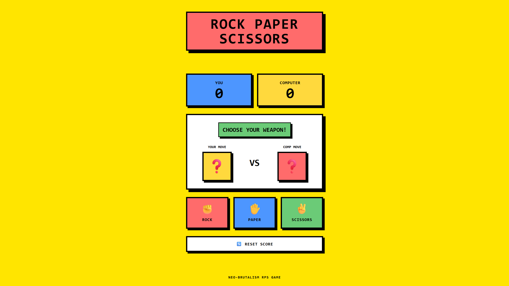

# 🪨✂️📄 Rock Paper Scissors

**Created:** August 18, 2026  
**Last Updated:** August 21, 2026

🔗 **Live Demo:** [Click Here 👆](https://rock-paper-scissors-gamma-blue-70.vercel.app/)

A fast, interactive, and fully responsive web-based game built with **HTML5**, **Tailwind CSS**, **CSS3 Animations**, and **vanilla JavaScript** to play Rock-Paper-Scissors against a computer bot in real-time. The project features a premium and striking **Neo-Brutalism UI** user interface, combining high-contrast vibrant colors, thick borders, and raw geometric depth with smooth, dynamic visual effects.

---



---

## ✨ Features

- 🎨 **Neo-Brutalism Aesthetics:** A premium, eye-catching UI featuring a vibrant color palette, bold typography, flat solid shadows, and distinct thick black borders.
- 🤖 **Smart Computer Opponent:** Seamlessly integrated with an automated bot that randomly generates moves for a highly competitive and fair gameplay experience.
- ⚡ **Dynamic Real-Time Logic:** Automatically evaluates game states instantly and updates the round results right after the user chooses their weapon.
- 🎛️ **Intuitive Weapon Selection:** Offers dedicated, accessible selection buttons for Rock, Paper, and Scissors with clear emoji indicators for user moves.
- 👥 **Persistent Score Tracker:** Features an interactive split scoreboard to independently track and display both your wins and the computer's score.
- 🚀 **Zero-Dependency Stack:** Engineered for maximum performance and lightning-fast loading using semantic HTML5, utility-first Tailwind CSS classes, and native vanilla JavaScript.

---

## 🛠️ Tech Stack

| Technology           | Purpose                 |
| -------------------- | ----------------------- |
| HTML5                | Page structure          |
| CSS3                 | CSS animations          |
| Tailwind CSS         | Styling and layout      |
| JavaScript (Vanilla) | Logic and interactivity |

---

## 📁 Project Structure

```text
rock-paper-scissors/
├── 📁 assets/               # Static assets
│   └── 📁 images/           # Images and icons
│       └── 📄 favicon.png   # Favicons on website
│       └── 📄 preview.png   # Project preview screenshot
├── 📁 node_modules/         # Dependencies managed by npm
├── 📁 src/                  # Application source logic
│   └── 📄 main.js           # JavaScript logic
│   └── 📄 style.css         # Tailwind CSS import and CSS animations
├── 📄 README.md             # Project documentation
├── 📄 index.html            # Entry HTML page
├── 📄 package-lock.json     # Locked npm package versions
├── 📄 package.json          # Node project metadata and scripts
└── 📄 vite.config.ts        # Vite bundler configuration
```

---

## ⚙️ How It Works

1. **User Choice & Bot Execution:** When a user clicks on a weapon button (Rock, Paper, or Scissors), the JavaScript engine captures the selection and instantly triggers an automated math function to generate a random move for the computer opponent.
2. **Game Logic Evaluation:** The application compares both choices based on standard rules (Rock beats Scissors, Scissors beats Paper, Paper beats Rock) to declare a winner, a loss, or a tie for the round.
3. **Dynamic DOM Rendering:** The application instantly updates the UI to show the selected moves, displays the round outcome, increments the respective score in the scoreboard, and dynamically manages the reset button state.

---

## ⚙️ Customization

- 🎨 **Modify Theme & Color Palette:** Open the main HTML file to tweak the Tailwind CSS background classes (e.g., `bg-yellow-400`, `bg-pink-400`) and borders to easily match your preferred color combination or branding.
- 📐 **Adjust Border & Shadow Depth:** Locate the Neo-Brutalism components in your utility classes and change the solid hard-shadow values (e.g., modifying `shadow-[4px_4px_0px_#000]` or `border-4`) to increase or decrease geometric depth.
- 🤖 **Extend Game Rules or Logic:** Open the JavaScript file to add custom winning animations, modify the computer bot's AI logic, or introduce new weapon choices (like Lizard or Spock) into the core match matrix.

---

<div align="center">

_"Every great app starts with someone brave enough to click `+` first."_

⭐ **If this counter counted anything for you, give the repo a star!** ⭐

</div>
